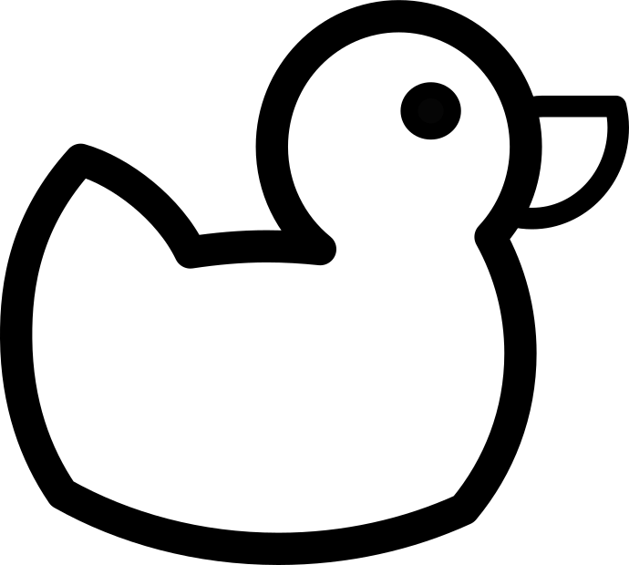

### DUCK 
## BIGGER DUCK
# MORE THAN BIGGER DUCK

Duck is the common name for numerous species of waterfowl in the family Anatidae. Ducks are generally smaller and shorter-necked than swans and geese, which are members of the same family. Divided among several subfamilies, they are a form taxon; they do not represent a monophyletic group (the group of all descendants of a single common ancestral species), since swans and geese are not considered ducks. Ducks are mostly aquatic birds, and may be found in both fresh water and sea water.

The word duck comes from Old English dūce 'diver', a derivative of the verb *dūcan 'to duck, bend down low as if to get under something, or dive', because of the way many species in the dabbling duck group feed by upending; compare with Dutch duiken and German tauchen 'to dive'.

Pacific black duck displaying the characteristic upending "duck"
This word replaced Old English ened/ænid 'duck', possibly to avoid confusion with other words, such as ende 'end' with similar forms. Other Germanic languages still have similar words for duck, for example, Dutch eend, German Ente and Norwegian and. The word ened/ænid was inherited from Proto-Indo-European; cf. Latin anas "duck", Lithuanian ántis 'duck', Ancient Greek νῆσσα/νῆττα (nēssa/nētta) 'duck', and Sanskrit ātí 'water bird', among others.

A duckling is a young duck in downy plumage[1] or baby duck,[2] but in the food trade a young domestic duck which has just reached adult size and bulk and its meat is still fully tender, is sometimes labelled as a duckling.

A male is called a drake and the female is called a duck, or in ornithology a hen
